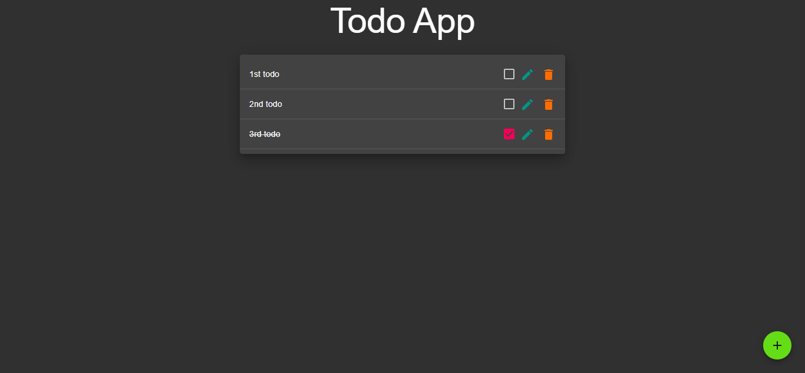
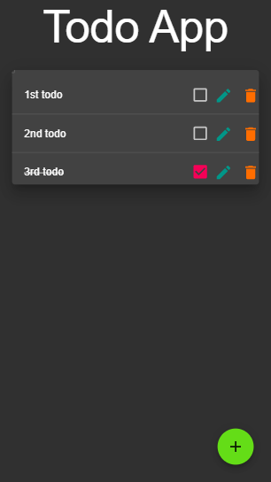

# Todo App React Express Restful

Todo App Implement CRUD Operations Built With ReactJS Technology, Restful API NodeJs BackEnd Server -> Express, MongoDB Database -> Mongoose .

## Table Of Contents

- [Todo App React Express Restful](#todo-app-react-express-restful)
  - [Table Of Contents](#table-of-contents)
  - [Install Dependencies](#install-dependencies)
  - [Quick Start](#quick-start)
  - [Demo](#demo)
  - [Screenshot](#screenshot)
  - [Useful Links](#useful-links)
  - [App Info](#app-info)
    - [Author](#author)
    - [Version](#version)
    - [License](#license)

## Install Dependencies

Client:

```bash
cd ./client
npm install
```

Server:

```bash
cd ./server
npm install
```

## Quick Start

Client:

```bash
cd ./client
npm start
```

Server:

```bash
cd ./server
npm start
```

Developer Server:

```bash
cd ./server
npm run dev
```

## Demo

[Demo](https://github-todo-app-react-express-restful.herokuapp.com/)

## Screenshot

Desktop View



Mobile View



## Useful Links

FrontEnd Only Version [Todo_App_React](https://github.com/Technology-Geek/Todo_App_React)

## App Info

### Author

[Technology-Geek](https://github.com/Technology-Geek)

### Version

1.0.0

### License

This project is licensed under the **MIT License**
